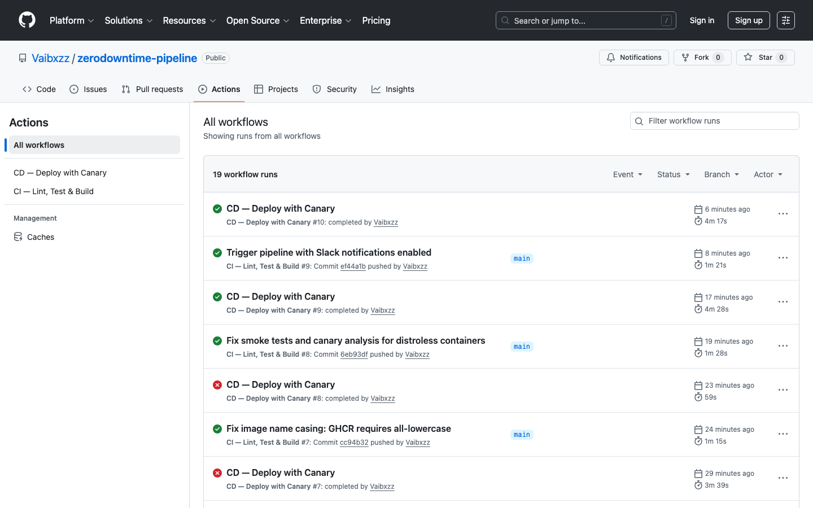
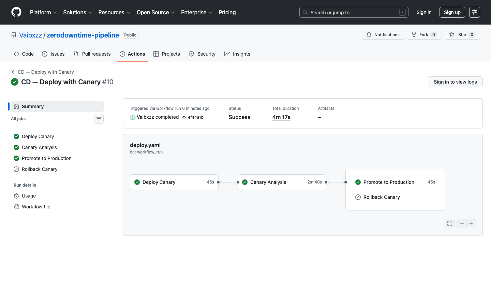

# Zero-Downtime Deployment Pipeline

A production-grade CI/CD pipeline that takes code from a GitHub push to production with **zero downtime** using canary deployments, automated rollback, and Slack/Discord notifications.

```
┌─────────────┐     ┌─────────────┐     ┌─────────────┐     ┌─────────────┐
│  Developer   │────▶│  GitHub CI  │────▶│   Canary     │────▶│  Production │
│  git push    │     │  Lint/Test/ │     │  10% traffic │     │  100%       │
│              │     │  Build/Push │     │  + analysis  │     │  promoted   │
└─────────────┘     └──────┬──────┘     └──────┬──────┘     └─────────────┘
                           │                    │
                     ┌─────▼──────┐       ┌─────▼──────┐
                     │  Slack/    │       │  Auto      │
                     │  Discord   │       │  Rollback  │
                     │  Notify    │       │  on Fail   │
                     └────────────┘       └────────────┘
```

## Pipeline in Action

**CI & CD workflow runs — all green:**



**Full canary deployment flow — Deploy → Analyse → Promote (Rollback skipped):**



## Architecture

### Pipeline Flow

```
git push main
    │
    ▼
┌──────────────── CI Workflow ────────────────┐
│                                             │
│  ┌────────┐  ┌────────┐  ┌──────────────┐  │
│  │  Lint  │  │  Test  │  │ Build & Push │  │
│  │  ───── │  │  ───── │  │ ──────────── │  │
│  │ golint │  │ go test│  │  Docker      │  │
│  │ vet    │  │ -race  │  │  → GHCR      │  │
│  └───┬────┘  └───┬────┘  └──────┬───────┘  │
│      └───────────┴──────────────┘           │
│                                  │          │
│                           Slack Notify      │
└──────────────────────────────────┬──────────┘
                                   │
                                   ▼
┌──────────────── CD Workflow ────────────────┐
│                                             │
│  ┌────────────────────────────────────────┐ │
│  │  1. Deploy Canary (10% traffic)       │ │
│  └────────────────┬───────────────────────┘ │
│                   ▼                         │
│  ┌────────────────────────────────────────┐ │
│  │  2. Canary Analysis (2 min)           │ │
│  │     - Pod readiness checks            │ │
│  │     - HTTP health probes              │ │
│  │     - Error rate < 5% threshold       │ │
│  └─────────┬──────────────┬──────────────┘ │
│            │              │                 │
│        HEALTHY        UNHEALTHY             │
│            │              │                 │
│            ▼              ▼                 │
│  ┌──────────────┐  ┌──────────────┐        │
│  │  3a. Promote │  │ 3b. Rollback │        │
│  │  Update      │  │ Scale canary │        │
│  │  stable pods │  │ to 0         │        │
│  │  Scale down  │  │ Alert team   │        │
│  │  canary      │  └──────────────┘        │
│  └──────────────┘                          │
│                                             │
│  Slack/Discord Notify at every stage        │
└─────────────────────────────────────────────┘
```

### Zero-Downtime Guarantees

| Mechanism | How it prevents downtime |
|---|---|
| `maxUnavailable: 0` | Rolling update never kills a pod before a new one is ready |
| `maxSurge: 1` | Spins up new pods before tearing down old ones |
| Readiness probe | Kubernetes only sends traffic to pods that pass `/readyz` |
| Startup probe | Gives slow-starting pods time before liveness kicks in |
| `preStop` hook | `sleep 5` lets iptables rules propagate before container exits |
| Graceful shutdown | Server stops accepting connections, drains in-flight requests |
| PodDisruptionBudget | At least 2 pods stay running during node drains |
| Canary analysis | Bad code never reaches 100% — rolls back automatically |

## Project Structure

```
.
├── .github/workflows/
│   ├── ci.yaml                 # Lint → Test → Build → Push → Notify
│   └── deploy.yaml             # Canary Deploy → Analysis → Promote/Rollback
├── cmd/server/
│   └── main.go                 # Application entry point with graceful shutdown
├── internal/
│   ├── handler/                # HTTP handlers + tests
│   ├── health/                 # Liveness & readiness probes + tests
│   └── middleware/             # Logging, metrics, recovery, request ID
├── k8s/
│   ├── base/                   # Core K8s manifests (Deployment, Service, HPA, PDB)
│   ├── canary/                 # Canary-specific deployment + weighted Ingress
│   └── overlays/
│       ├── staging/            # Kustomize overlay for staging
│       └── production/         # Kustomize overlay for production
├── scripts/
│   ├── canary-analysis.sh      # Polls canary health, decides promote/rollback
│   ├── notify.sh               # Slack + Discord webhook notifications
│   ├── rollback.sh             # Tears down canary, optionally rolls back stable
│   └── smoke-test.sh           # Post-deploy HTTP verification
├── Dockerfile                  # Multi-stage build (golang:alpine → distroless)
├── .golangci.yml               # Linter config
└── .env.example                # Required environment variables
```

## Quick Start

### Prerequisites

- Docker
- kubectl configured to a Kubernetes cluster
- NGINX Ingress Controller installed in the cluster
- GitHub repository with Actions enabled

### 1. Clone and configure

```bash
git clone https://github.com/vaibhavsrivastava/zerodowntime-pipeline.git
cd zerodowntime-pipeline
cp .env.example .env
# Edit .env with your Slack webhook URL
```

### 2. Deploy base infrastructure

```bash
kubectl apply -k k8s/base
```

### 3. Set up GitHub Secrets

Go to **Settings → Secrets and variables → Actions** and add:

| Secret | Description |
|---|---|
| `KUBECONFIG` | Base64-encoded kubeconfig: `cat ~/.kube/config \| base64` |
| `SLACK_WEBHOOK_URL` | Slack Incoming Webhook URL |
| `DISCORD_WEBHOOK_URL` | *(Optional)* Discord Webhook URL |

### 4. Push and watch

```bash
git push origin main
# CI runs → Image built → Canary deployed → Analysis → Promote/Rollback
# Slack notifies at each stage
```

## Deployment Strategies

### Canary (Default)

The pipeline uses NGINX Ingress canary annotations for traffic splitting:

1. **Deploy canary** — 1 replica with the new image, receives 10% traffic
2. **Analysis** — 2-minute window checking pod readiness and HTTP health
3. **Promote** — If healthy, update stable deployment and scale canary to 0
4. **Rollback** — If unhealthy, kill canary and alert the team

Traffic weights are controlled via:
```yaml
nginx.ingress.kubernetes.io/canary: "true"
nginx.ingress.kubernetes.io/canary-weight: "10"
```

### Rolling Update (Stable Deployment)

The stable Deployment uses a rolling update strategy tuned for zero downtime:

```yaml
strategy:
  type: RollingUpdate
  rollingUpdate:
    maxUnavailable: 0    # Never kill before replacement is ready
    maxSurge: 1          # Create 1 extra pod during rollout
```

## Manual Operations

### Trigger a rollback

```bash
# Roll back canary only
NAMESPACE=zerodowntime ./scripts/rollback.sh

# Roll back canary AND revert stable to previous revision
NAMESPACE=zerodowntime ./scripts/rollback.sh --full
```

### Run smoke tests locally

```bash
NAMESPACE=zerodowntime ./scripts/smoke-test.sh stable
NAMESPACE=zerodowntime ./scripts/smoke-test.sh canary
```

### Send a test notification

```bash
export SLACK_WEBHOOK_URL="https://hooks.slack.com/services/..."
./scripts/notify.sh "Test notification" "good" "v1.0.0"
```

## Application Endpoints

| Endpoint | Purpose |
|---|---|
| `GET /` | Returns version, hostname, uptime |
| `GET /healthz` | Liveness probe — always 200 if process is running |
| `GET /readyz` | Readiness probe — 503 during startup/shutdown, 200 when ready |
| `GET /metrics` | Prometheus metrics (request count, latency histograms) |
| `GET /api/v1/status` | JSON status for external monitoring |

## Monitoring

The application exposes Prometheus metrics at `/metrics`:

- `http_requests_total` — Counter with labels: method, path, status
- `http_request_duration_seconds` — Histogram with labels: method, path

Pod annotations enable automatic Prometheus scraping:
```yaml
prometheus.io/scrape: "true"
prometheus.io/port: "8080"
prometheus.io/path: "/metrics"
```

## Notifications

Both Slack and Discord are supported. Notifications fire at every pipeline stage:

| Event | Color | Example |
|---|---|---|
| CI passed | Green | `:white_check_mark: CI passed for repo` |
| CI failed | Red | `:x: CI failed for repo` |
| Canary deployed | Yellow | `:canary: Canary deployed at 10% traffic` |
| Promotion success | Green | `:rocket: Production promoted to abc1234` |
| Rollback triggered | Red | `:rotating_light: Canary ROLLED BACK` |

## Configuration

Key environment variables in the CD workflow:

| Variable | Default | Description |
|---|---|---|
| `CANARY_WEIGHT_START` | `10` | Initial canary traffic percentage |
| `CANARY_ANALYSIS_SECONDS` | `120` | How long to monitor the canary |
| `ERROR_RATE_THRESHOLD` | `5` | Max error rate (%) before rollback |

## License

MIT
